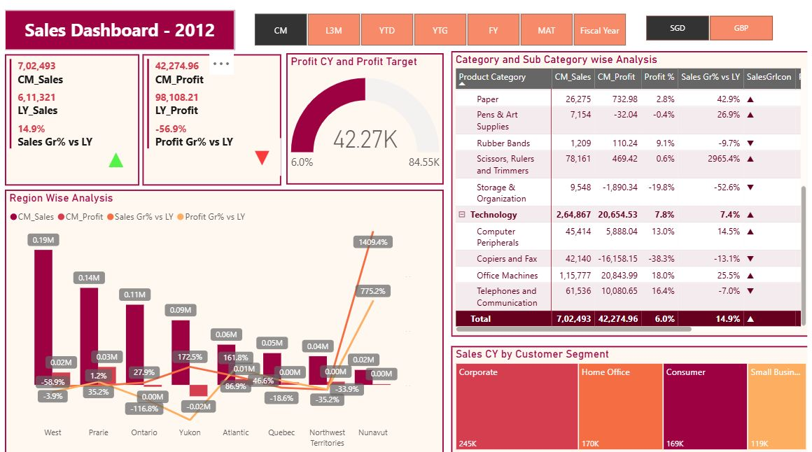

# 📊 Sales Dashboard | Power BI

An interactive **Sales Analytics Dashboard** built in **Microsoft Power BI** to monitor sales performance, profit analysis, regional trends, customer segments, and product category insights. This dashboard helps business users make data-driven decisions by tracking key KPIs and identifying growth opportunities.

---

## 📷 Dashboard Preview



---

# 🚀 Project Overview

This dashboard provides a complete overview of business performance with interactive filters, KPI cards, charts, and drill-down capabilities.

It enables users to:

- Monitor Sales and Profit
- Compare Current Year vs Last Year Performance
- Analyze Regional Sales Trends
- Track Profit Target Achievement
- Identify Top Performing Categories & Sub-Categories
- Analyze Customer Segment Sales
- Filter data dynamically using different time periods and currency selections

---

# 📌 Key KPIs

- 💰 Current Month Sales
- 💵 Current Month Profit
- 📈 Sales Growth % vs Last Year
- 📉 Profit Growth % vs Last Year
- 🎯 Profit Target Achievement
- Profit Percentage
- Sales Growth

---

# 📊 Dashboard Features

### KPI Cards
- Current Month Sales
- Last Year Sales
- Current Month Profit
- Last Year Profit
- Sales Growth %
- Profit Growth %

### Interactive Filters
- Current Month (CM)
- Last 3 Months (L3M)
- Year To Date (YTD)
- Year To Go (YTG)
- Fiscal Year (FY)
- Moving Annual Total (MAT)
- Fiscal Year Filter
- Currency Selector (SGD / GBP)

### Visualizations

- Clustered Column Chart
- Line Chart
- Gauge Chart
- Matrix Table
- Treemap
- KPI Cards
- Slicers

---

# 📈 Business Insights

- Region-wise Sales & Profit Analysis
- Product Category Performance
- Sub-Category Analysis
- Customer Segment Analysis
- Profit Margin Tracking
- Sales Growth vs Last Year
- Profit Growth vs Last Year
- Target vs Actual Profit

---

# 🛠 Tools & Technologies

- Microsoft Power BI
- Power Query
- DAX (Data Analysis Expressions)
- Data Modeling
- Interactive Slicers
- Matrix Visual
- Gauge Visual
- Treemap
- Clustered Column Chart

---

# 📚 DAX Measures Used

Some of the important DAX measures include:

- Total Sales
- Total Profit
- Sales Growth %
- Profit Growth %
- Profit Margin %
- Current Year Sales
- Last Year Sales
- Current Year Profit
- Last Year Profit
- Target Profit
- Variance
- YTD Sales
- Moving Annual Total (MAT)

---

# 🎯 Business Benefits

✔ Monitor overall business performance

✔ Track sales growth across regions

✔ Compare yearly performance

✔ Identify profitable product categories

✔ Understand customer buying behavior

✔ Measure business performance against targets

✔ Support strategic business decisions

---

# 📂 Dashboard Sections

- Executive KPI Summary
- Profit Target Analysis
- Region-wise Performance
- Product Category Analysis
- Customer Segment Analysis

---

# 📸 Dashboard Screenshot


---

# ⭐ Skills Demonstrated

- Data Cleaning
- Data Transformation
- Data Modeling
- DAX Calculations
- Business Intelligence
- Interactive Dashboard Design
- Data Visualization
- KPI Reporting
- Performance Analysis
- Storytelling with Data

---

# 📁 Repository Structure

```
Sales-Dashboard/
│
├── Sales Dashboard.pbix
├── SalesDashboard.jpg
├── Dataset/
│   └── Sales_Data.xlsx
├── README.md
```

---

# 📬 Connect With Me

**Avinash Singh**

💼 Aspiring Data Analyst

- LinkedIn: https://www.linkedin.com/in/avinash-singh-59645b237
- GitHub: https://github.com/avinashfeb3

---

## ⭐ If you found this project helpful, don't forget to give it a Star!
